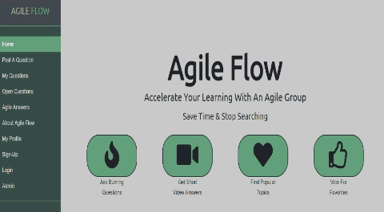

# Agile Flow

Accelerate your learning with an Agile team.

## Description

Accelerate your learning of new tech with a community that lets you get to the heart of burning tech questions.  Stop wasting time searching and get to the core of things in less than 15 minutes.

Agile Flow is an applicaton that is designed essentially to assist web developers in learning about targeted topics in a relatively short amount of time, leveraging a peer developer community that could filter, update or improve potential answers.

The goal is to help others learn more in decreased time by providing a trusted online community where users can share and receive technical knowledge. We provide a simple, easy to use platform where users can post questions and/or submit answers.

## How to Use Agile Flow

On entering the site, the user is directed to a default home page where existing questions/topics are listed.  A vertical navigation bars allows the user to visit different parts of the site (for some, the user must be registered).

A topic or question can have three states: open, pending or closed. Open and pending questions are displayed on top of the screen. Open questions are ones that users have posted but have not been answered or claimed yet and appear with a light green background. A pending question is one that has been claimed and is displayed on a light olive green background. Once a question is claimed, it is assumed that the user who adopted the question will actively research and post an answer to the topic. Otherwise, a site administrator can re-open the question. The third state a topic can have is closed; this means the question has been answered. The answered topic should contain a short text that explains the reasoning behind the response and a `url` of the video link.

Interestingly, the Agile Flow app allows for a user to express `interest` in a topic, or `vote` on an answer. If many users express `interest` in a topic, this means there is a high demand for an answer. If an answer card receives many `votes`, this means the user community is satisfied with a topic's response and considers the answer to be a quality one.

The side menu allows for a user to post a question. When a user posts a question, that question's state is 'open'. By way of the navigation bar, a user can also easily view open questions and agile answers. To view `My Questions`, a user must be registered and have claimed an open question (these questions appear as `pending` on the landing page). Another option is the `About Agile` item which displays a description of the application. There are also the `Signup`, `Login`, `Logout` and `Admin` options which are described in another section.

## How Agile Flow Works

The application uses the following developer tools on the front end:
1. Javascript
2. Bootstrap
3. HTML and CSS
4. Ajax

On the backend, we leveraged the following tools:
1. Nodejs / Express
2. Sequelize
3. Handlebars
4. MomentJS
5. For Authentication, we used Passportjs
6. Bodyparser

## Installation

This app can be cloned and installed following the procedure below.

1. Now we are ready to clone this app by running the following command. `git clone git@github.com:SigmaVX/Nuggets.git` Note that if `git` and `node` need to be installed, the steps to do so are the following: a) git must be installed. [Download git.](https://git-scm.com/downloads) and b. nodejs must also be installed. [Download nodejs](https://nodejs.org/en/download/)

2. Since this file makes use of several node modules, please run `npm install`.  This installs all of the dependencies.

3. `Agile Flow` is a full stack app that uses nodejs and express on the back end. It needs to be deployed to on a platform that provides (like Heroku) "back-end" support. [Guide to deploying a Node Web Server on Heroku](https://github.com/RutgersCodingBootcamp/RUTSOM201801FSF4-Class-Repository-FSF/blob/master/13-express/Supplemental/HerokuGuide.md)

4. It is also necessary to setup MySQL for the Agile flow app. Please refer to the following guide. [Guide](https://github.com/RutgersCodingBootcamp/RUTSOM201801FSF4-Class-Repository-FSF/blob/master/14-handlebars/Supplemental/MySQLHerokuDeploymentProcess.pdf)

## Comments

The source code for the Agile Flow app was added to the following github repository:
[Github repo](https://github.com/SigmaVX/Agile-Flow)

A link to the app on heroku:
[Agile Flow App](https://blooming-shore-12371.herokuapp.com/)
